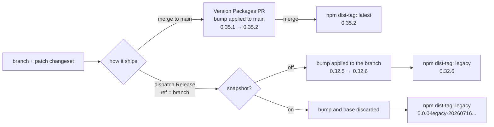

# Releasing

Hearth publishes to npm from GitHub Actions using [changesets](https://github.com/changesets/changesets) and npm [trusted publishing](https://docs.npmjs.com/trusted-publishers/) (OIDC). 

There are no npm tokens in CI, authentication comes from the workflow's OIDC identity. npm matches that identity on the repository and the workflow `.github/workflows/release.yml`

Every release starts the same way, a branch with a changeset on it. Where it ends up depends on how you ship it:



The `snapshot` branch is the one to internalise: it does not bump versions. It defaults to `0.0.0`, so a `major` changeset and a `patch` changeset produce identical output.

| | Normal release | Manual publish |
|---|---|---|
| Trigger | push to `main` | `workflow_dispatch` |
| dist-tag | `latest` | `canary` / `next` / `beta` / `rc` / `legacy` / `experimental` |
| Scope | every package with a changeset | single package |
| Source | `main` | any branch except `main` |

## Normal releases

You don't do anything by hand. Add a [changeset](https://github.com/changesets/changesets/blob/main/docs/adding-a-changeset.md) to your PR:

```sh
pnpm changeset
```

That writes a small markdown file to [`.changeset/`](.changeset/) recording which packages changed, the bump type, and the changelog line. Commit it with your work.

When the PR lands on `main`, the `Release` job opens (or updates) a **Version Packages** PR that applies every pending changeset, bumping versions and writing changelogs. Merging *that* PR publishes each affected package to `latest`.

So a release is two merges: your PR, then the Version Packages PR.

## Manual publish

For anything that must not become `latest` i.e. hotfixes, release candidates, throwaway builds for testing or development, etc..

Run it from **Actions → Release → Run workflow**.

> [!IMPORTANT]
> Leave **"Use workflow from"** on `main`, and name the branch you actually want to publish in the `ref` input labelled **`Branch to publish`**. The workflow definition comes from **"Use workflow from"**; only the code being built comes from `ref`. Dispatching from your own branch would run that branch's copy of the workflow — on an old release line that copy is stale or has no `workflow_dispatch` trigger at all — so the job guards on it and fails fast.

### Inputs

| Input | Notes |
|---|---|
| `ref` | Branch to build and publish. Must contain both the fix and a changeset for the package. |
| `channel` | dist-tag to publish under. `latest` is deliberately not offered. |
| `package` | Directory name under `packages/`, e.g. `react-native`. |
| `snapshot` | Publish an ephemeral `0.0.0-<channel>-<timestamp>` instead of the real version bump. |
| `dry_run` | **Defaults to on.** Builds and packs but does not upload. |
| `provenance` | **Defaults to on.** Attaches an npm provenance attestation. |
| `debug` | Verbose npm logging. |

### `snapshot` - what it actually does

`snapshot` is **not** a dry run, and it does not publish your real version.

- **off** (default) — `changeset version` applies the changesets on the ref. A `patch` changeset on `0.32.5` publishes a real, permanent `0.32.6`.
- **on** — `changeset version --snapshot <channel>` discards the bump and publishes `0.0.0-<channel>-<timestamp>`, e.g. `0.0.0-legacy-20260716095256`.

Use `snapshot` for a build you want to install in a consumer app and then forget. Use it freely, the version is unique every run, so it never collides.

**A snapshot still needs a changeset.** `--snapshot` only rewrites the version of packages that already have one, so with no changesets it versions nothing, exits successfully, and the publish then fails on a version already on npm. The bump type is ignored — the version is always `0.0.0-<channel>-<timestamp>` — but a changeset must exist for it to act on.

This is also why `ref: main` is rejected. Versioning `main` outside the normal flow *claims its next version number*: the manual publish succeeds, then the Version Packages PR merges and the release job cannot publish the version it just resolved, because you already took it.

> [!WARNING]
> Treat npm versions as immutable. While we can unpublish within 24 hours, assume there is no second attempt, get it right with `dry_run` first.

### Publishing

The case this workflow exists for: shipping a fix to consumers stuck on an old major, without disturbing `latest`.

1. Branch from the **last tag of that line**, not from `main`. Tags are per package, named `<pkg-name>@<version>`:
   ```sh
   git checkout -b release/rn-0.32.6-my-fix @utilitywarehouse/hearth-react-native@0.32.5
   ```
2. Cherry-pick or write the fix, and add a changeset for it.
3. Push the branch. 
4. Open a draft PR for review. Label with do not merge.
4. Once it's been reviewed, dispatch **Release** from `main` with your branch set for `ref`, `channel: legacy`, and `dry_run` **on**.
5. Check the version in the run summary is what you expect, then re-run with `dry_run` off.

> [!WARNING]
> Do not merge your changes. Kill your PR and branch after its been published

Consumers then install it explicitly:

```sh
npm install @utilitywarehouse/hearth-react-native@legacy
```

`latest` is untouched throughout, the publish is set to `--tag <channel>`. This matters more than it looks: npm moves `latest` to whatever you publish *without* a tag regardless of semver, so an untagged hotfix would silently downgrade every default install.

> [!NOTE]
> The version bump happens only inside the runner and is never committed — the job has `contents: read`. Your branch keeps its old version and its changeset file, and no git tag is created for a manual publish. Record the ref somewhere if you need to reproduce the build.

If the fix also belongs on `main`, it needs its own separate changeset there. Do not merge a hotfix branch into `main` to get it: the branch's changeset would bump `main` a second time for the same fix.

## Troubleshooting

**`422 ... Error verifying sigstore provenance bundle: package.json: "repository.url" is ""`**

The package on that ref has no `repository` field. npm checks it against the provenance attestation and rejects the upload. Add it to `packages/<pkg>/package.json` on the ref:

```json
"repository": {
  "type": "git",
  "url": "git+https://github.com/utilitywarehouse/hearth.git",
  "directory": "packages/<pkg>"
}
```

Every release line tagged before 2026-07-15 (#1419) predates this field. Nothing catches this early: npm only checks at upload, so the run fails at the very last step after a full build, and the error names sigstore rather than the missing field. 

Setting `provenance` off could clear it though untested. Our preference is for packages to be publised with provenance attestations.

**`E403 ... cannot publish over previously published version`**

You shouldn't see this, if you do something is wrong.

`changeset version` produced no bump for the selected package, so its version still matches what is already on npm and npm versions are immutable. Usually the ref has no changeset for that package (it may have changesets for *other* packages, which is why the run got this far). Add one for the package you are publishing.


## References

- Workflow: [`.github/workflows/release.yml`](.github/workflows/release.yml)
- Changeset config: [`.changeset/config.json`](.changeset/config.json)
- `ci:version` — `changeset version`, then regenerates changelogs and LLM docs
- `ci:publish` — builds packages, then `changeset publish`
